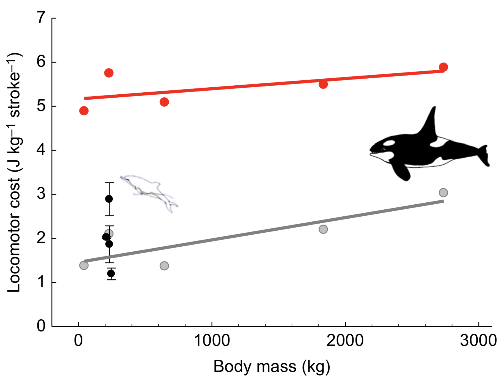

```{r global_options, include=FALSE}
knitr::opts_chunk$set(echo=FALSE, warning=FALSE, message=FALSE,
                      fig.height = 3, fig.width = 5)
```

```{r setup}
library(tidyverse)
library(scales)
library(knitr)
library(kableExtra)
library(lmodel2)
library(ggsci)

# Load data
# Morphological data
abbr_binom = function(binom) {
  paste(str_sub(binom, 1, 1), 
        str_extract(binom, " .*"), 
        sep = ".")
}
morphologies <- read_csv("data/foragestats_combined_ko2.csv") %>% 
  mutate(Species = str_replace(Species, "_", " ")) %>% 
  group_by(Species) %>% 
  summarize(Length_m = first(Body_length_m),
            Mass_kg = first(Body_mass_kg)) %>% 
  mutate(Clade = ifelse(str_detect(Species, ".*ptera.*"),
                        "Mysticete",
                        "Odontocete"),
         Family = recode(Species,
                         `Balaenoptera bonaerensis` = "Balaenopteridae",
                         `Balaenoptera musculus` = "Balaenopteridae",
                         `Balaenoptera physalus` = "Balaenopteridae",
                         `Berardius bairdii` = "Ziphiidae",
                         `Globicephala macrorhynchus` = "Delphinidae",
                         `Globicephala melas` = "Delphinidae",
                         `Grampus griseus` = "Delphinidae",
                         `Megaptera novaeangliae` = "Balaenopteridae",
                         `Mesoplodon densirostris` = "Ziphiidae",
                         `Orcinus orca` = "Delphinidae",
                         `Phocoena phocoena` = "Phocoenidae",
                         `Physeter macrocephalus` = "Physeteridae",
                         `Ziphius cavirostris` = "Ziphiidae")) %>% 
  # binomial is a factor ordered by species length with an abbreviated label
  arrange(Length_m) %>% 
  mutate(binomial = factor(Species, 
                           levels = unique(Species),
                           labels = abbr_binom(unique(Species))))
binom_levels <- levels(morphologies$binomial)

# Prey data
prey_data <- read_csv("data/Cetacea model output BOUT_EXTANT_v2.csv") %>% 
  select(-(X13:X25)) %>% 
  mutate(Species = recode(Species,
                          bonarensis = "bonaerensis",
                          Phocaena = "phocoena"),
         Genus = recode(Genus,
                        Physter = "Physeter",
                        Phocoaena = "Phocoena"),
         binomial = factor(abbr_binom(paste(Genus, Species)),
                           levels = binom_levels)) %>% 
  filter(`MR exponent` == 0.45)  # data duplicated for multiple MR exponent values

# Rorqual feeding rates
rorqual_data <- read_csv("data/lunge_rates_from_Paolo.csv") %>%
  filter(species != "be") %>% 
  mutate(duration_h = `deployment-time_secs` / 60 / 60,
         binomial = factor(recode(species,
                                  ba = "B. bonaerensis",
                                  bp = "B. physalus",
                                  bw = "B. musculus",
                                  mn = "M. novaeangliae"),
                           levels = binom_levels),
         lunge_h = total_lunges / duration_h)

# Odontocete feeding rates
odontocete_data <- read_csv("data/foragestats_combined_ko2.csv") %>%
  mutate(binomial = factor(abbr_binom(str_replace(Species, "_", " ")),
                           levels = binom_levels)) %>% 
  filter(taxa == "O")

# Labels for logarithmic scales
log_labels <- trans_format("log10", math_format(10^.x))
```

## Abstract

This is a tool intended for resource managers to understand some of the sub-lethal effects of SONAR on cetaceans. The model makes a first order approximation by estimating (1) the energy intake lost to foraging cessation and (2) the additional locomotor costs from increased swim speeds. Energetic parameters for the model come from empirical data and theoretical scaling relationships. 

We present the model derivation and apply it to four case studies of typical behavioral responses. *SUMMARY OF RESULTS HERE*.

## Energetic model

The energetic consequences of SONAR exposure, as modeled here, take the form:

$$E_{sonar} = P_{in} \times t_d + P_{out}(U_f) \times t_f$$

Where E~sonar~ is the energy cost of sonar exposure, P~in~ is the rate of energy consumption during undisturbed foraging, t~d~ is the time displaced from foraging, P~out~ is the increased rate of locomotor costs during the flight response relative to undisturbed movement, U~f~ is the animal's speed during flight, and t~f~ is the flight time.

The first term ($P_{in} \times t_d$) is the energy the animal would have consumed during foraging. The second term ($P_{out}(U_f) \times t_f$) is the additional energy spent in elevated locomotion.

## Consumption power ($P_{in}$)

The rate of consumption is the product of feeding rates and prey quality. We estimated feeding rates from tag data (lunges for rorquals, buzzes for odontocetes) and prey quality from active acoustics (rorquals) or stomach contents (odontocetes).

$$P_{in} = r_f \times E_p$$

Where r~f~ is the feeding rate and E~p~ is the energy from prey consumed per feeding event.

### Empirical feeding rates ($r_f$)

Feeding rates were empirically derived from tag data. Lunges for mysticetes (rorquals only) and buzzes for odontocetes.

#### Mysticetes

The mysticete feeding rate is defined as the mean number of lunges per hour of deployment for deployments exceeding 24 hours. Shorter deployments tend to have higher lunge rates due to diel foraging patterns. Overall, lunge rates decrease with body size.

```{r bw_feeding_rate, results="asis"}
lungerate <- rorqual_data %>% 
  filter(duration_h >= 24) %>%
  group_by(Species = binomial) %>% 
  summarize(N = n(),
            `Lunge rate` = round(mean(lunge_h), digits = 1))

kable(lungerate, "latex", booktabs = TRUE)
```

```{r}
rorqual_data %>% 
  mutate(dur_cat = factor(ifelse(duration_h < 24, "< 1 day", "> 1 day"),
                          levels = c("< 1 day", "> 1 day"))) %>% 
  ggplot(aes(binomial, lunge_h, fill = dur_cat)) +
  geom_boxplot() +
  geom_point(shape = 21,
             position = position_jitterdodge()) +
  scale_fill_aaas() +
  expand_limits(y = 1) +
  labs(y = "Lunges per hour") +
  theme_classic(base_size = 8) +
  theme(axis.title.x = element_blank(),
        legend.title = element_blank(),
        legend.position = c(0.7, 0.7))
```

#### Odontocetes

Odontocetes forage with echolocation so feeding events are identifiable by an acoustic signature. Feeding rates are estimated as buzzes per hour. The tagging durations on odontocetes were not as long as mysticetes, so I used all available data. The relationship between feeding rates and body size is more variable than for mysticetes. This makes sense given the wider range of prey and dive depths for odontocetes.

*Note: there's a Pm with NA for buzz count.* 

```{r, results = "asis"}
odontocete_data %>%  
  group_by(Species = binomial) %>% 
  summarize(N = n(),
            `Buzz rate (per hour)` = (total_buzz_count / total_duration_h) %>% 
              mean(na.rm = TRUE) %>% 
              round(digits = 1)) %>% 
  kable("latex", booktabs = TRUE)
```

```{r}
odontocete_data %>% 
  filter(binomial != "P. phocoena") %>% 
  left_join(select(morphologies, binomial, Family, Length_m), 
            by = "binomial") %>%
  mutate(buzz_h = total_buzz_count / total_duration_h) %>%
  ggplot(aes(binomial, buzz_h, color = Family)) +
  geom_boxplot() +
  geom_point(shape = 21,
             position = position_jitter()) +
  scale_color_aaas() +
  expand_limits(y = 1) +
  labs(y = "Buzzes per hour",
       caption = "P. phocoena not shown, mean buzz rate = 96.8/hr") +
  theme_classic(base_size = 8) +
  theme(axis.title.x = element_blank(),
        axis.text.x = element_text(hjust = 1,
                                   angle = 30),
        legend.title = element_blank(),
        legend.position = c(0.8, 0.85))
```


### Empirical prey energy ($E_p$)

Prey energy was empirically derived from acoustic backscatter (mysticetes) and stomach samples (odontocetes). Filter feeders consume the most energy per feeding event. Delphinids target more energy-rich prey than Ziphids.

```{r fig.width=5}
prey_data %>% 
  uncount(weights = Percent) %>% 
  ggplot(aes(binomial, `Energy (kJ)`, color = Family)) +
  geom_boxplot() +
  scale_y_log10(name = "Energy per feeding event (kJ)",
                labels = log_labels) +
  scale_color_aaas() +
  expand_limits(y = 1) +
  theme_classic(base_size = 8) +
  guides(color = guide_legend(nrow = 2, byrow = TRUE)) +
  theme(axis.title.x = element_blank(),
        axis.text.x = element_text(hjust = 1,
                                   angle = 30),
        legend.position = c(.05, .75),
        legend.justification = c(0, 0),
        legend.title = element_blank(),
        legend.direction = "horizontal")
```

### Modeled $P_{in}$

From before:

$$P_{in} = r_f \times E_p$$

Based on empirical feeding rates and prey energy density, the rate of energy consumption covers four orders of magnitude: from 2.4e3 kJ/hr (P. phocoena) to 1.4e7 kJ/hr (B. musculus).

```{r}
Ep_tbl <- prey_data %>%
  uncount(weights = Percent) %>% 
  group_by(binomial) %>% 
  summarize(Ep_kJ = mean(`Energy (kJ)`))

rf_tbl <- rorqual_data %>% 
  filter(duration_h >= 24) %>%
  group_by(binomial) %>% 
  summarize(rf_h = round(mean(lunge_h), 1)) %>%
  rbind(odontocete_data %>%  
          group_by(binomial) %>% 
          summarize(rf_h = round(mean(total_buzz_count / total_duration_h, na.rm = TRUE), 1)))

Pin_tbl <- inner_join(Ep_tbl, rf_tbl, by = "binomial") %>% 
  mutate(Pin_kJ_h = Ep_kJ * rf_h) %>% 
  left_join(select(morphologies, binomial, Family))

Pin_tbl %>% 
  ggplot(aes(binomial, Pin_kJ_h, fill = Family)) +
  geom_col() +
  scale_y_log10(name = expression(P[`in`] ~~ (kJ/h)),
                labels = log_labels) +
  scale_fill_aaas() +
  expand_limits(y = 1) +
  theme_classic(base_size = 8) +
  guides(fill = guide_legend(nrow = 2, byrow = TRUE)) +
  theme(axis.title.x = element_blank(),
        axis.text.x = element_text(hjust = 1,
                                   angle = 30),
        legend.position = c(.05, .75),
        legend.justification = c(0, 0),
        legend.title = element_blank(),
        legend.direction = "horizontal")
```

The ratio of P~in~ to basal metabolic rate (BMR, estimated with Kleiber's equation) puts the consumption rates of mysticetes into perspective. Odontocetes consume energy at roughly 10-100 times BMR. The larger mysticetes, however, are closer to 1000 times BMR. This probably reflects both the high costs of lunge feeding as well as the demands of a capital breeding strategy.

```{r}
Pin_tbl %>% 
  left_join(select(morphologies, binomial, Mass_kg), by = "binomial") %>% 
  mutate(BMR_kcal_day = 70 * Mass_kg ^ 0.75,
         BMR_kJ_day = BMR_kcal_day * 4.184,
         BMR_kJ_h = BMR_kcal_day / 24,
         ratio = Pin_kJ_h / BMR_kJ_h) %>% 
  ggplot(aes(binomial, ratio, fill = Family)) +
  geom_col() +
  scale_y_log10(labels = function(l) paste(comma(l), ":1", sep = "")) +
  scale_fill_aaas() +
  labs(y = expression(P[`in`]:BMR)) +
  theme_classic(base_size = 8) +
  guides(fill = guide_legend(nrow = 2, byrow = TRUE)) +
  theme(axis.title.x = element_blank(),
        axis.text.x = element_text(hjust = 1,
                                   angle = 30),
        legend.position = c(.05, .75),
        legend.justification = c(0, 0),
        legend.title = element_blank(),
        legend.direction = "horizontal")
```

## Flight power ($P_{out}$)

The rate of energy expenditure during the flight response (flight power) is a function of the animals' elevated speed. In turn, stroke frequency has a relationship with body length dependent on speed. I modeled flight power as:

$$P_{out}(U_f) = (f_s(U_f) - f_s(U_b)) \times C_L \times m$$

Where f~s~ is a function relating stroke frequency to swimming speed, U~f~ and U~b~ are the animal's speed during the flight response and the basal, undisturbed state, C~L~ is the mass-specific locomotor cost of fluking (Williams et al. 2017), and m is the animal's mass.

### Fluking frequencies (f~f~)

Animals can swim efficiently by maintaining a Strouhal number of approximately 0.3 (Rohr & Fish 2004). The Strouhal number is a dimensionless ratio of the form:

$$S_t = \frac{f}{U}A$$

Where $A$ is the stroke amplitude. Cetacean stroke amplitudes are typically one fifth body length (reference?), so by fixing $S_t$ at 0.3 I can estimate stroking frequencies for a given speed as:

$$f = \frac{1.5U}{L}$$

Where $L$ is the length of the animal.

The cruising speed of swimming animals is invariant with size (Sato et al. 2007), about 1.5 m/s. The predicted stroking frequencies for cetaceans in this study at cruising speed are:

```{r}
fs_fun <- function(U, L) 1.5 * U / L
U_b_ms <- 1.5

morphologies %>% 
  mutate(f_s = fs_fun(U_b_ms, Length_m)) %>% 
  ggplot(aes(Length_m, f_s)) +
  geom_line() +
  expand_limits(x = 1) +
  scale_x_log10(breaks = c(2, seq(0, 25, by = 5))) +
  scale_y_log10(breaks = c(0.1, 0.5, 1, 1.5)) +
  labs(x = "Length (m)",
       y = "Stroke frequency (Hz)") +
  theme_classic()
```

### Locomotor cost ($C_L$)

Williams et al. 2017 calculated *C~L~* for cruising speeds as:

$$C_L = 1.46 + 0.0005m$$



The grey line in this figure (reproduced from Williams et al. 2017) is C~L~ at cruising speeds and the red line is at maximum aerobic output. I extrapolated the grey line to estimate C~L~ for all cetaceans, which I recognize is dodgy but it's the best available data.

```{r}
CL_fun <- function(m) 1.46 + 0.0005 * m
```

### Modeled $P_{out}$

I present two case studies for the increased locomotor costs of the flight response. *Z. cavirostris and B. musculus? Do I need to use tag data? Can I get $U_f$ from the literature?*

```{r}
Pout_fun <- function(u, l, m) {
  f_f <- fs_fun(u, l)
  f_b <- fs_fun(U_b_ms, l)
  (f_f - f_b) * CL_fun(m) * m
}
```

# Total energetic cost ($E_{sonar}$)

TODO: finish functional response section and get good estimates for $t_d$, $U_f$ and $t_f$. Present *x* case studies. *Which species do we have good data for?* For now, I'm trying the following:

```{r, results="asis"}
response_tbl <- tibble(binomial = factor(c("M. densirostris",
                                           "Z. cavirostris",
                                           "B. bonaerensis",
                                           "B. musculus"),
                                         levels = binom_levels),
                       t_d_min = c(6*60,
                                   6*60,
                                   2.5*60,
                                   60),
                       t_f_min = c(30,
                                   30,
                                   60,
                                   5),
                       U_f_ms = c(4.5,
                                  4.5,
                                  3.5,
                                  2.5),
                       Reference = c("DeRuiter et al. 2013 Fig 1.",
                                     "DeRuiter et al. 2013 Fig 1.",
                                     "Kvadsheim et al. 2017 Fig 2.",
                                     "Southall et al. 2019 bw11\\_219b"))

response_tbl %>% 
  rename(Species = binomial,
         `$t_d \\text{ (min)}$` = t_d_min,
         `$t_f \\text{ (min)}$` = t_f_min,
         `$U_f \\text{ (m/s)}$` = U_f_ms) %>% 
  kable("latex", booktabs = TRUE, escape = FALSE)
```

```{r, results="asis"}
ratio_lbl <- function(x) {
  x <- signif(x, 3)
  case_when(x < 1 ~ sprintf("%.3f", x),
            x < 10 ~ sprintf("%.2f", x),
            x < 100 ~ sprintf("%.1f", x),
            TRUE ~ sprintf("%.0f", x))
}

E_sonar_tbl <- response_tbl %>% 
  left_join(select(morphologies,
                   binomial,
                   Mass_kg,
                   Length_m),
            by = "binomial") %>%
  # P_in
  left_join(Pin_tbl, by = "binomial") %>%
  # P_out
  mutate(f_f = fs_fun(U_f_ms, Length_m),
         f_b = fs_fun(U_b_ms, Length_m),
         C_L = CL_fun(Mass_kg),
         Pout_W = Pout_fun(U_f_ms, Length_m, Mass_kg)) %>% 
  # E_sonar
  # The units are a little wonky. Intake is in units of kJ/hour and output
  # is in J/s (W).
  mutate(E_in_kJ = Pin_kJ_h * t_d_min / 60,
         E_out_kJ = Pout_W / 1000 * t_f_min * 60,
         E_sonar_kJ = E_in_kJ + E_out_kJ,
         BMR_kcal_day = 70 * Mass_kg ^ 0.75,
         BMR_kJ_day = BMR_kcal_day * 4.184,
         E_BMR = E_sonar_kJ / BMR_kJ_day)

E_sonar_tbl %>% 
  transmute(Species = binomial,
            `$E_{out} \\text{ (kJ)}$` = signif(E_out_kJ, 3),
            `$E_{in} \\text{ (kJ)}$` = signif(E_in_kJ, 3),
            `$E_{sonar} \\text{ (kJ)}$` = signif(E_sonar_kJ, 3),
            `$E_{sonar}:\\text{ BMR}$` = ratio_lbl(E_BMR)) %>% 
  kable("latex", booktabs = TRUE, escape = FALSE)
```
