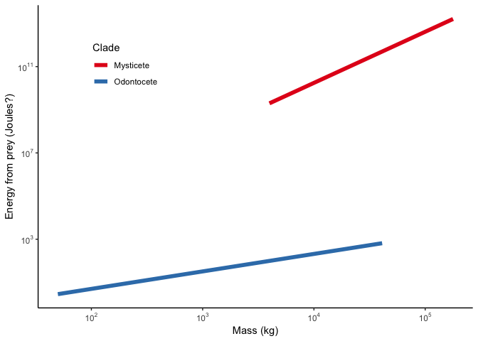

Energetic Consequences of Sonar Exposure
================

-   [Literature](#literature)
-   [Functional responses](#functional-responses)
-   [Energetic parameters](#energetic-parameters)

What are the energetic consequences for cetaceans when exposed to sonar? The following model makes a first order approximation by estimating (1) the energy intake lost to foraging cessation and (2) the additional energy expenditure from increased swim speeds. We considered these two factors in four potential scenarios:

1.  No response
2.  Cessation of foraging without flight
3.  Cessation of foraging with flight
4.  Extreme response

The model was paramterized using data and models from other sources (see table below). We used functional responses (e.g. mean flight distance) from the literature. The energy cost of lost feeding opportunities were estimated with the scaling relationship between body size and feeding rate in Jeremy's scaling paper. The energy cost of increased swim speeds during flight were estimated using models from Williams et al. 2017.

Literature
----------

| Reference                | Species                    |  N\_tags| Notes                                                                                |
|:-------------------------|:---------------------------|--------:|:-------------------------------------------------------------------------------------|
| Tyack et al. 2011        | Mesoplodon densirostris    |        1| Only 1 tag, but other data from sonar array                                          |
| DeRuiter et al. 2017     | Balaenoptera musculus      |       37| How did the transition probability from deep feeding to other states change in CEEs? |
| DeRuiter et al. 2013     | Ziphius cavirostris        |        2| Reduced time foraging in response to proximal sonar, but not distant                 |
| Friedlaender et al. 2016 | Balaenoptera musculus      |        9| Includes prey data                                                                   |
| Goldbogen et al. 2013    | Balaenoptera musculus      |       17| Basis for Friedlaender et al. 2016 and DeRuiter et al. 2017                          |
| Kvadsheim et al. 2017    | Balaenoptera acutorostrata |        4| SoCal + Norway. 1 CEE + 1 control in each location                                   |
| Southall et al. 2019     | Ziphius cavirostris        |        0| Prey distribution in SoCal sonar array                                               |

Functional responses
--------------------

*Fill me in*

Energetic parameters
--------------------

Energy acquired from prey scales sublinearly among odontocetes \[Ep=0.12Mc0.81\] but superlinearly among mysticetes \[Ep=5.83Mc2.37\]. *Note: Jeremy's paper has a negative coefficient for mysticete Ep scaling (v8.3:115) but I think that's a mistake.*

*If I understand correctly, Ep is energy per feeding event, so to get energy intake per unit time we also need the scaling equation for feeding rate. Figure 2 in Jeremy's paper has \[feeding events / dive\] ~ \[dive time - TADL\]. Can we get feeding rates from something like that?*
